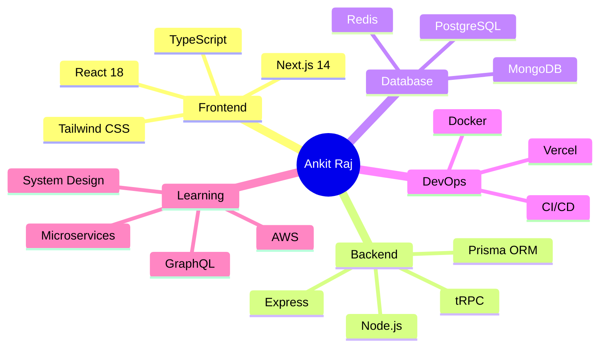

<!-- Header with animated gradient -->
<div align="center">
  


</div>

<div align="center">


<br/>

[](https://github.com/rajankit3107)
[](https://github.com/rajankit3107)
[](https://github.com/rajankit3107?tab=repositories)

</div>

<br/>

## 🌟 About Me

```javascript
const developer = {
    name: "Ankit Raj",
    location: "Greater Noida, India 🇮🇳",
    education: "Bennett University",
    role: "Full-Stack Developer",
    
    workingOn: {
        frontend: ["Next.js", "React", "TypeScript", "Tailwind CSS"],
        backend: ["Node.js", "Express", "Prisma", "tRPC"],
        database: ["PostgreSQL", "MongoDB", "Redis"],
        realtime: ["WebSockets", "Socket.IO"],
        auth: ["NextAuth.js", "JWT", "OAuth"],
        tools: ["Git", "Docker", "Vercel", "Postman"]
    },
    
    currentProjects: [
        "💰 NextPay - Secure money transfer platform",
        "💬 Scalable chat application with WebSockets", 
        "🎵 Muzer - Social music streaming platform",
        "🔐 DevOps security implementations"
    ],
    
    passions: ["Clean Code", "System Design", "UI/UX", "Performance"],
    goal: "Building products that make a difference 🎯"
};
```

<br/>

## 🛠️ Tech Stack

<div align="center">

### Frontend Development


### Backend Development


### Database & Cloud


### Tools & Others


</div>

<br/>

## 🚀 Featured Projects

<div align="center">

<table>
<tr>
<td width="50%" valign="top">

### 🏦 NextPay Platform
**Modern Money Transfer Application**

- 🔐 Secure user authentication & authorization
- 💸 Real-time balance updates & transactions
- 🎨 Beautiful glassmorphism UI design
- ⚡ Lightning-fast performance optimization

**Tech:** `Next.js` `TypeScript` `Prisma` `PostgreSQL`

[](https://github.com/rajankit3107/next-pay)

</td>
<td width="50%" valign="top">

### 💬 Scalable Chat System
**High-Performance Real-time Messaging**

- 🔄 WebSocket-based real-time communication
- 📱 Responsive cross-platform design
- 🏗️ Scalable architecture for high traffic
- 💾 Message persistence & history

**Tech:** `WebSockets` `TypeScript` `Node.js`

[](https://github.com/rajankit3107/scalable-chat)

</td>
</tr>
<tr>
<td width="50%" valign="top">

### 🎵 Muzer Streaming Platform
**Social Music Discovery & Sharing**

- 🎶 YouTube integration for music streaming
- 👥 Social voting & recommendation system
- 🎯 Personalized music discovery
- 📊 Real-time user engagement metrics

**Tech:** `Next.js` `TypeScript` `YouTube API`

[](https://github.com/rajankit3107/muzer)

</td>
<td width="50%" valign="top">

### 🌤️ Climate Weather App
**Sophisticated Weather Information System**

- 🌍 Real-time weather data integration
- 📊 Detailed forecasting & analytics
- 🎨 Intuitive & responsive interface
- 🔍 Location-based weather search

**Tech:** `React` `TypeScript` `Weather API`

[](https://github.com/rajankit3107/climate)

</td>
</tr>
</table>

</div>

<br/>

## 📊 GitHub Statistics

<div align="center">


<br/><br/>


<br/>


</div>

<br/>

## 🏆 GitHub Trophies

<div align="center">

[](https://github.com/ryo-ma/github-profile-trophy)

</div>

<br/>

## 🔥 Streak Stats & Contributions

<div align="center">


<br/>


</div>

<br/>

## 🎯 Current Focus

<div align="center">



</div>

<br/>

## 📫 Let's Connect!

<div align="center">

[](https://linkedin.com/in/rajankit3107)
[](https://twitter.com/rajankit3107)
[](mailto:rajankit3107@gmail.com)
[](https://rajankit.dev)
[](https://instagram.com/rajankit3107)

<br/><br/>

### 💭 Random Dev Quote


<br/>

**⭐ From [Ankit Raj](https://github.com/rajankit3107)**

*"Code is like humor. When you have to explain it, it's bad." – Cory House*

</div>

<!-- Footer -->

